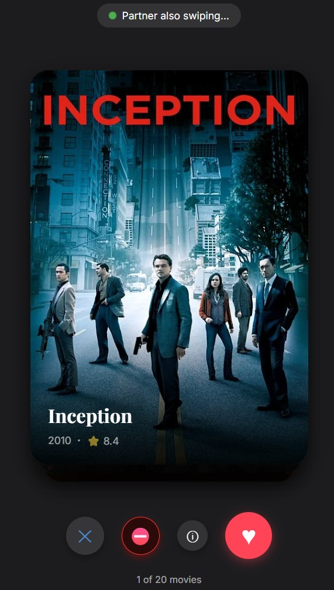
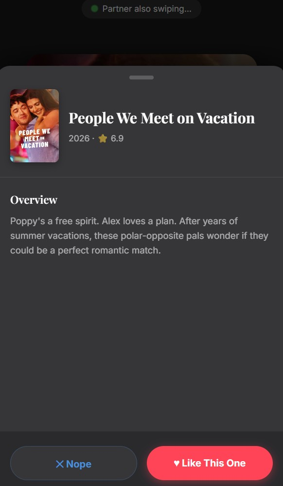
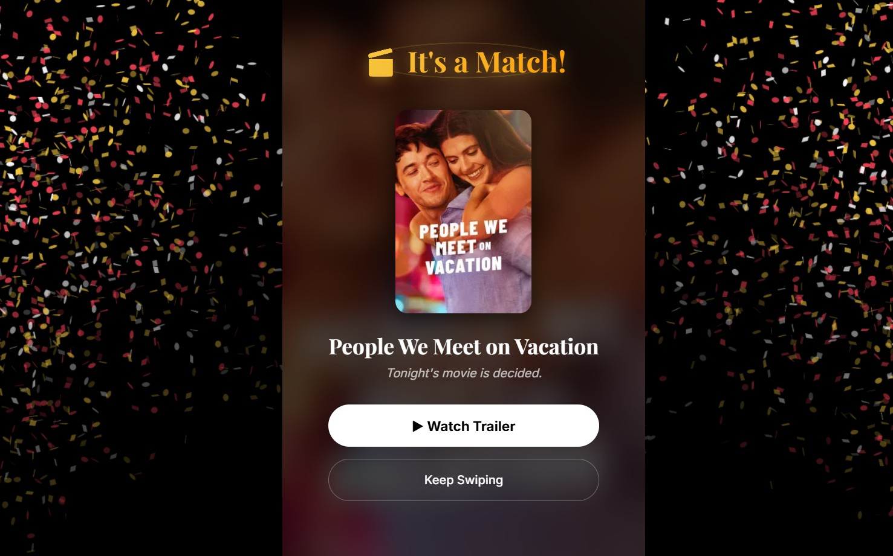

# CuddleCombat

Ever had a fight or lets say more of a disagreement with your friend or partner on which movie or shows to watch together? Yeah, i can feel you not because i had fight or argument with someone, its just that my movie time got disturbed due to the fight of the other two :p 

Anyways, to solve this issue and reduce the time of juggling between movies which one to watch and not, I made CuddleCombat! Yess, this web-app works like a tinder for your movie night, its so simple to use, you and your friend/partner can join a room and swipe according to your indvidiual likes dislikes, the moment you both liked the same movie or webseries,Congratss!! you got what you need to watch together.

## Screenshots

## How to Use

1. One person creates a room and selects the streaming platforms and genres they want to explore.
2. Share the generated room code with your partner.
3. The partner joins the room using the code.
4. Start swiping! Swipe **Right** if you want to watch the movie/show, or **Left** if you don't.
5. When both of you swipe right on the same content, a full-screen match celebration will appear!

## Project Structure

- `client/` - React frontend powered by Vite
  - `src/components/` - Reusable UI components (Landing, SwipeDeck, MatchScreen, RoomSetup)
  - `src/hooks/` - Custom React hooks for API and socket management
  - `src/services/` - Socket.io client initialization
- `server/` - Node.js Express backend
  - `socket/` - Real-time matching logic and room coordination
  - `services/` - Third-party API integrations (TMDB data fetcher)

## Output

The app ensures real-time synchronization between two devices. Once a match is confirmed by the backend, both clients immediately display a synced celebratory "MATCH" screen with the details of the selected movie or web series.

## Requirements

- Node.js (v14 or higher)
- npm or yarn

## Tech Stack Used

- **Frontend:** React, Vite, CSS Modules, react-spring, @use-gesture/react, canvas-confetti
- **Backend:** Node.js, Express, Socket.io
- **APIs:** TMDB API (movies and TV shows), freekeys (dynamic key generation)

## Contributing

Pull requests are welcome. For major changes, please open an issue first to discuss what you would like to change.

## License

MIT
